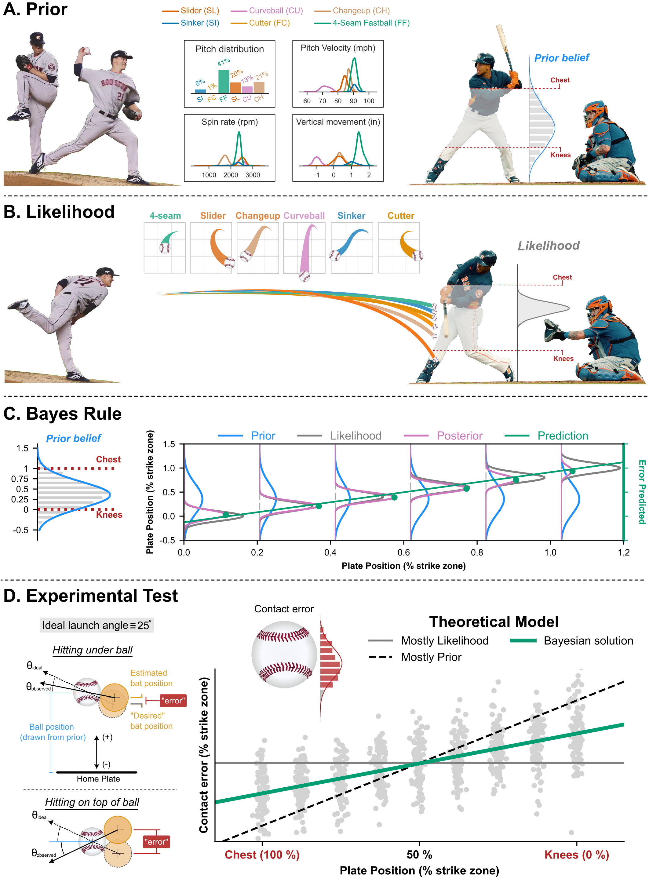

This is the code for the paper, "Bayesball: Bayesian integration in professional baseball batters". The `main.ipynb` will run the analysis and display the figures. For cleanliness, each main section is added to its own `.py` file in the `/code/` folder.

This is the (current) Figure 1 from the paper and tells the main story. 

   

  
<!--  -->
